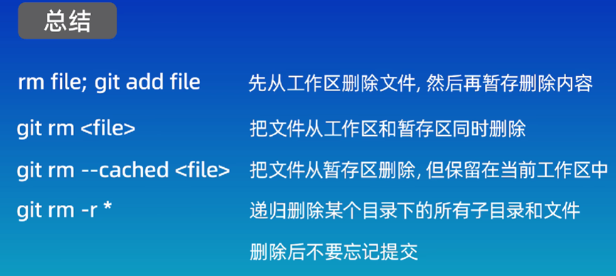
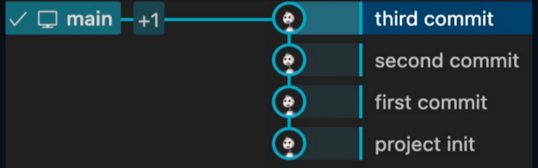

<font color="99ccff">

---

## 1、Git简介

**Git是一个免费开源的分布式版本控制系统**。它使用一个特殊的叫做仓库的数据库来记录文件的变化。仓库中的每个文件都有一个完整的版本历史记录，可以看到谁在什么时间修改了文件的什么内容，需要的时候可以恢复到以前的版本。

版本控制系统分两种：
- 集中式，如SVN，CVS；
- 分布式，如Git，Mercurial。

集中式版本控制系统：所有的文件都保存在中央服务器上，每个人的电脑上只保存了一个副本，当你需要修改文件的时候，首先需要从中央服务器上下载最新的版本，然后添加你想要的修改内容，修改完后再上传回中央服务器。
**优点：使用起来非常简单。
缺点：中央服务器的单点故障。**

分布式版本控制系统：每个人的电脑上都有一个完整的版本库，所以我们可以在本地进行修改，不需要考虑网络问题。即使中央服务器出现故障，也可以继续工作。当需要将我们的修改内容分享给其他人的时候，只需要将仓库互相同步一下就可以了。
**优点：免费开源，速度快，功能强大，支持离线工作，分支管理强大。**

---

## 2、Git的初始化配置

Git的使用方式：

1. 命令行
2. 图形化界面（GUI）
3. IDE插件/扩展

**推荐使用命令行，可以加深对Git的理解，提高工作效率。**

`git -v 查看版本信息。`

`git config --global user.name “……” 配置用户名`

`git config --global user.email  …… 配置邮箱`

```git
省略（Local）：本地配置，只对本地仓库有效。
--global：全局配置，所有仓库生效。
--system：系统配置，所有用户生效。
一般不会使用system，使用最多的是global。
名字中间有空格，必须用双引号括起来，否则可以省略双引号。
```

`git config --global credential.helper store 保存用户名和密码，不用每次都要输入。`

`git config --global --list 查看配置信息。`

---

## 3、新建仓库

新建一个版本库，对本地的代码进行管理。
版本库，又叫仓库，repository，简称repo。
仓库可以理解为一个目录，这个目录里所有的文件都可以被Git管理起来。
每个文件的修改、删除、添加等操作，Git都能够跟踪到。以便任何时候都可以跟踪历史或还原到之前的某个版本。

创建仓库：

1. 电脑本地直接创建一个仓库
`git init`
2. 从远程服务器上克隆一个已经存在的仓库。
`git clone`

首先，需要找到一个合适的位置来创建一个空目录，切换到工作目录，然后git init。
这个目录下会多一个叫做.git的隐藏目录，存放了git仓库的所有数据。不要随意删除或修改里面的内容，否则会破坏Git仓库。
git init 后面可以指定目录的名称，如果指定了，就会在当前目录下面创建一个新的目录作为Git仓库。

git clone 后面加上仓库的地址。

---

## 4、Git的工作区域和文件状态


**Git的本地数据管理分为3个区域，分别是工作区（working directory）、暂存区（staging area/index）、本地仓库（Local repository）。**
**工作区**：工作目录、本地工作目录，即我们自己电脑上的目录，在资源管理器里面能够看到的文件夹就是工作区
**暂存区**：也称为索引，是一个临时存储区域，用于保存即将提交到Git仓库的修改内容
**本地仓库**：git init命令创建的仓库，包含了完整的项目历史和元数据，是Git存储代码和版本信息的主要位置。

当修改完工作区的内容后，需要添加到暂存区（git add），然后将暂存区的修改提交到本地仓库（git commit）。
这个过程中，我们可以使用git提供的命令来查看、比较或撤销修改内容，来保证版本控制的准确性和完整性。

Git中的文件有4种状态：

1. **未跟踪（untrack）**：新创建的，还没有被git管理起来的文件。
2. **未修改（unmodified）**：已经被Git管理起来，但是文件的内容没有发生变化的文件。
3. **已修改（modified）**：已经修改过的文件，但是还没有添加到暂存区里面。
4. **已暂存（staged）**：修改过后并且已经添加到暂存区内的文件。

---

## 5、添加和提交文件

```git
git init：创建仓库。可以查看当前仓库处在哪个分支、有哪些文件以及这些文件当前处在怎样的一个状态。
git status：查看仓库的状态。
git add：添加到暂存区。
git commit：提交暂存区内的文件。
git rm --cached <file>…：取消文件的暂存。
```

`git commit -m “……”  可以指定提交的信息，这个信息会被记录到仓库中。如果不指定-m参数，那么git commit命令会进入一个交互式界面。默认使用vim来编辑提交信息。`

`git add 可以使用通配符来添加多个文件。`
`git add 可以接受文件夹作为参数，需要添加所有文件时，可以用git add .这个命令来把当前文件夹下的所有文件添加到暂存区里面。.表示当前目录。`

`git log  查看提交记录。包括提交ID，每次提交的作者、邮箱、时间、注释信息。`
`git log --oneline可以查看简洁的提交记录。只显示每次提交的ID和注释信息。`

---

## 6、Git reset回退版本

在实际开发中，需要撤销修改内容，回退到之前的版本。
reset命令用于回退版本，可以退回到之前的某一个提交的状态。
共有3种用法：
1、`git reset --soft`
soft参数表示回退到某一个版本，并且保留工作区和暂存区的所有修改内容。
2、`git reset --hard`
hard参数表示回退到某一个版本，并且丢弃工作区和暂存区的所有修改内容。
3、`git reset --mixed`
mixed介于soft和hard之间，它表示回退到某一个版本，并且只保留工作区的修改内容，而丢弃暂存区的修改内容。
mixed是reset命令的默认参数。


HEAD^表示上一个版本
`git ls --files  查看暂存区的内容。`

一般来说，**当我们连续提交了多个版本，但是又觉得这些提交没有多大意义，可以合并成一个版本的时候，就可以通过--soft和--mixed这两个参数来进行回退之后重新提交。
主要的区别是在重新提交之前，mixed模式需要执行一下mix add操作来将变动的内容重新添加到暂存区。而soft模式就不需要。**
**hard参数的使用场景，是你真的要放弃目前本地的所有修改内容，应该谨慎使用。**
git中的所有操作都可以回溯。

`git reflog命令可以查看操作的历史记录，然后找到误操作之前的版本号，然后再使用git reset命令来回退到这个版本就可以了。`

---

## 7、使用git diff查看差异


`git diff 查看文件在工作区、暂存区、版本库之间的差异。`
它还可以查看文件在两个特定版本之间的差异，或者文件在两个分支之间的差异。
**开发过程，一般使用图形化工具，但有的时候需要在一些没有图形化工具的服务器上使用git。**

`git diff 默认比较工作区和暂存区之间的差异内容，它会显示发生更改的文件以及更改的详细信息。`


第一行提示了发生变更的文件，第二行中，git将文件的内容使用hash算法生成一个40位的hash值，这里只显示了hash值的前7位，后面的100644表示的是文件的权限。
再往下就是刚刚修改的内容。
红色的文件表示删除的内容，绿色的是刚刚添加的内容。

```git
git diff HEAD可以比较工作区和版本库之间的差异。
git diff cached可以比较暂存区和版本库之间的差异。
git diff后面加上两个版本的提交ID，可以比较两个特定版本之间的差异。
可以使用HEAD来表示当前分支的最新提交。
使用HEAD~或HEAD^表示上一版本。
比较当前版本和上一版本之间的差异：
git diff HEAD~ HEAD
git diff HEAD^ HEAD
可以在波浪线后加上具体的数字n，表示n次之前的版本。
git diff HEAD~n HEAD
git diff 加上文件名，这样就只会显示这个文件的差异内容。
git diff 加上两个分支名，可以比较两个分支之间的差异。
```


---

## 8、使用git rm删除文件

有2种常见方式：

1. 先用rm命令从工作区删除文件。再git add .更新。
2. git rm 文件名。

最后记得提交：git commit。



---

## 9、.gitignore忽略文件

作用：忽略掉一些不应该被加入到版本库中的文件。这样可以让我们的仓库体积更小、更加干净。


我们可以在这个文件中列出需要忽略的文件的模式，这样这些文件就不会被提交到版本库中。
实际应用中，我们可以使用*.log来忽略所有的日志文件。
对于已经在版本库中的文件，即使加入.gitignore，git也会监测变化。
.gitignore文件生效，需要这个文件不能是已经添加到版本库中的文件。

`git rm --cached 文件名：只删除版本库的文件，不删除本地文件。`
git默认不会将空的文件夹添加到仓库里面。这个时候我们使用git status也是看不到任何变化的。
`git status --s：--s是short的缩写，表示查看状态这个命令的简略模式。`

**显示的第一个问号表示暂存区的状态。
显示的第二个问号表示工作区的状态。**

.gitignore要忽略文件夹，需要最后加上/


.gitignore的语法如下：

所有空行或者以 ＃ 开头的行都会被 Git 忽略

! 表示不忽略

匹配模式可以以（/）开头只匹配当前目录下的匹配文件夹，可以防止递归

匹配模式可以以（/）结尾表示当前匹配是一个目录

**说明**
==.gitignore这个文件里的代码是从上往下执行的
如果你前面说要忽略所有文件*，后面又说不忽略所有文件!*，那么最终的效果是不忽略所有文件，也就是说后面的命令会覆盖签名的命令==

如果是写/Entertainment/，最前面的/表示只匹配当前目录，所以看到下面的子目录的Entertainment文件夹并没有被忽略
如果是Entertainment/，则忽略根目录中所有满足含Entertainment的文件夹（包括子目录）

规则语法详细说明

1. 在版本库根目录创建.gitignore
2. 修改文件，添加忽略正则表达式，书写例子如下：
•!表示忽略匹配到的文件或文件夹
•以‘#’开始的行，被视为注释
•？代表任意的一个字符
•＊：代表任意数目的字符
•[abc]：代表a,b,c中任一字符即可

```.gitignore
#忽略test文件夹及文件夹下文件
test

#忽略以.exe结尾的文件
*.exe

#忽略*.a和*.b文件 

 *.[ab]

#忽略*.b和*.B文件，code.b除外

*.[bB]

!code.b


#忽略test文件和test目录

test

#忽略所有test目录
test/

#只忽略test文件，不忽略test目录

test

!test/

#只忽略当前目录下的test文件和目录，子目录的test不在忽略范围内

/test
```

## 10、远程仓库

Github：代码托管平台，世界上超过90%的开源项目都托管在Github。

搜索框：可以搜索仓库。

仓库的分支和tag


右边可看到：版本数、贡献者、使用的主要语言


是否添加一个README文件。
是否添加一个.gitignore文件。
开源许可证文件。


1. 本地没有仓库。

2. 本地有仓库。

3、导入其他平台的仓库。


远程仓库地址的2种方式

1. HTTPS：HTTPS在我们把本地的代码push到远程仓库的时候，需要验证用户名和密码。
2. SSH：推送的时候不需要验证用户名和密码，但是需要在Github上添加SSH公钥配置。比较推荐，更加安全和方便。

使用git clone 加上远程仓库地址可以克隆本地仓库。

第一次回车：执行命令。
第二次回车：指定文件名。
第三次回车：密钥的密码。
如果不是默认的文件名，需要添加config文件。test为密钥的文件名。


git clone ...之后，显示需要输入密码。
Tips：如果创建秘钥的时候没有输入密码，那么这里也直接回车即可。

Git是一个分布式的版本控制系统，本地仓库和远程仓库是两个仓库，它们是相互独立的。
同步远程仓库和本地仓库的修改内容，让它们的状态保持一致：

`push 把本地仓库的修改推送给远程仓库。`
`pull 把远程仓库的修改拉取到本地仓库。`


## 11、关联本地仓库和远程仓库


添加一个远程仓库
`git remote add <shortname> <url>`

origin：远程仓库的别名。也可以自己指定一个其他的名字。

`git remove -v`
查看当前仓库所对应的远程仓库的别名和地址。

第二行命令意为指定分支的名称为main，因为默认的分支名为main，所以这一行命令可省略。

最后一行命令的意思是把本地的main分支和远程的origin仓库的main分支关联起来。
-u是upstream的缩写。
git push -u origin main:main
后面的main：main表示把本地的main分支（左边参数）推送给远程的main分支（右边参数）。
如果本地分支的名称和远程分支的名称相同，就可以省略，只写一个main

README文件是一个Markdown格式的文件，Markdown是一种轻量级的标记语言，语法格式非常简单。
当我们访问一个仓库的地址的时候，这个仓库的首页就会显示这个README文件中的内容。
`git pull<远程仓库名><远程分支名>:<本地分支名>`

拉取远程仓库的修改内容。
在执行完git pull后，git会自动为我们执行一次合并操作，如果远程仓库的修改内容和本地仓库中的修改内容没有冲突的话，那么合并操作就会成功。否则合并操作就会由于冲突而失败。这个时候就需要我们手动来解决冲突。
从远程仓库获取内容还可以使用git fetch命令，fetch命令只是获取远程仓库的修改，但是并不会自动合并到本地仓库中，而是需要我们手动合并。


---

## 12、Gitee、GitLab

**Gitee**：国内平台。如果项目面向国内，可以考虑码云。
**GitLab**：私有化部署。我们可以搭建属于自己的GitLab服务器，然后我们的项目就可以在这个服务器上管理。
主要适合有些企业对代码的安全性要求比较高，不允许使用Github或Gitee这种公有代码托管平台。
Gitee在创建仓库的时候只能选择私有仓库。创建完成后，在设置里面，把它设置为公开仓库。

我们可以在自己的服务器上部署一个GitLab代码托管服务。
部署过程可以参考GitLab官方文档。
我们可以在浏览器中输入localhost来访问我们的GitLab服务。然后输入用户名和密码，进入首页。
SAST：静态应用安全测试。

---

## 13、VScode插件git


---

## 14、分支

分支非常适合团队协作和开发管理。比如多个开发人员可以在自己的分支上进行开发工作，最后在合并到主线代码库。
我们也可以在一个分支上进行新功能的开发，或者建立一个问题修复的分支来处理一些bug和缺陷，这样可以让主线代码仓库处于一个随时可用的比较稳定的状态，而不会影响其他功能的开发和测试，保证了项目的正常运行和高效协作。

**优点：提高团队协作的效率，减少冲突和错误的影响，让团队中的每个人都能独立开发和测试。**

`git branch`
可以查看项目的所有分支。

命令行的回显中前面带有*的是我们目前所处在的分支。
项目经理会把新的开发任务不同的功能分发给成员。
`git branch 分支名`
可以创建一个新的分支。

`git checkout 分支名`
切换到不同的分支。
git checkout命令还可以用来恢复文件或者目录到之前的某一个状态。

如果分支名称和文件名称相同，会出现歧义，git checkout命令会默认切换分支，而不是恢复文件。

为了避免歧义，`git switch`专门用来切换分支。

`git merge`可以将不同的分支合并到当前分支中。merge后面的分支名称是将要被合并的分支名称，而我们当前所在的分支就是合并后的目标分支。

`git log --graph --oneline --decorate --all`

命令行中 `git log`命令可以查看分支图
分支被合并后不会消失，除非手工删除。
`git branch -d 分支名`删除分支。-d表示删除已经合并的分支。
如果没有被合并的分支则不能删除，这时需要换成`-D`进行删除。

git分支的最佳实际：为了保证分支管理的顺畅和有效，我们需要制定明确的分支管理流程和规范，同时加强分支的保护和权限控制，避免常见的分支管理错误。


---

## 15、解决合并冲突

一般情况下，如果两个分支的修改内容没有重合的部分，那么合并分支就非常简单，git会为我们自动完成合并，但如果两个分支修改了同一个文件的同一行代码，git就不知道保留哪个分支的修改内容了，也就产生冲突，需要我们手动解决。
feat是feature的缩写，一般用来表示开发某个功能的分支。

`git commit -a -m“……”`
在提交命令后加上-a参数，就可以一个命令完成添加暂存和提交两个动作。
-a -m可以写成-am
`git status`查看冲突文件的列表
`git diff`查看冲突文件的具体内容。
git会使用左箭头、等号、右箭头来分别表示两个分支的修改内容。
这时需要我们再次手动编辑这个文件，然后提交。
`git merge –abort 终止合并。`


---

## 16、回退和rebase

rebase：变基

`git rebase branch名字`
我们可以在任意分支上执行rebase操作，rebase会从分叉点把整个分支都移动到目标分支的最新提交记录后面


`alias graph=“git log --oneline --graph --decorate --all ”`
定义别名graph，以后可以直接用graph来查看图形化的提交记录。

merge
**优点**：不会破坏原分支的提交记录，方便回溯和查看。
**缺点**：会产生额外的提交结点，分支图比较复杂。
rebase
**优点**：不会新增额外的提交记录，形成线性历史，比较直观和干净。
**缺点**：会改变提交历史，改变了当前分支branch out的节点。
**应该避免在共享分支中使用rebase。**

一般来说，==如果只是想把两个分支合并起来，而不关心提交历史的话，那么就可以使用git merge命令。
如果确定只有自己在一个分支上开发，并且希望提交历史更加清晰明了，那么建议使用rebase命令。==

---

## 17、分支管理和工作流模型

工作流模型：一些比较好的规范和流程，可以让我们的工作更高效，更有条理。


较常用和流行的模型：**gitflow**
将分支分成了5种类型，每种类型都有自己的用途。

1. 主线分支/基线分支。只接受来自hotfix和release的合并请求，不允许直接push修改。
主线分支是项目的核心分支，它包含了项目的最新稳定版本的代码。我们应该随时保证主线分支中的代码是可发布的。一般来说，主线分支中的代码会被部署到生产环境中。主线分支中的代码是不允许直接修改的，只能通过合并分支的方式来修改。每次合并分支都建议生成一个新的版本号，这样可以方便追踪和回溯。可以通过git tag命令来标记版本号。
1. 线上版本bug热修复分支，用于解决线上问题，修复完成后合并回main分支，命名规则：hotfix-#issueid-desc
一般来说，问题修复分支是从主线分支中分离出来的，从main分支pull出来，用于解决生产环境发生的缺陷。修复完成后会合并到主分支和开发分支中，一般会将这个问题修复分支删除掉，发布小版本。
1. 版本发布（release）分支
也叫预发布分支，包含了项目最新发布预版本的代码，永久分支，用于发布前的测试和验证。一般来说，预发布分支是从开发分支中分离出来的，当预发布分支的代码稳定后，会合并到主分支和开发分支中。
在测试验证的过程中遇到的问题，会在预发布分支中进行修改、提交，并且cherry-pick到开发分支中。当预发布分支的代码稳定后，会合并到主分支和开发分支中。然后会将预发布分支删除掉。
1. 开发分支
它是从主线分支中分离出来的，包含了项目最新开发版本的代码，用于开发和测试。开发分支也是项目的核心分支，和main分支一样，是一个长期存在的分支
1. 功能分支
功能分支一般是指包含了项目某个新功能的代码，用于开发新的功能，它们都是从开发分支中分离出来，当功能分支的代码稳定后，会以某种方式合并回开发分支中。

版本号规则：
**主版本（Major Version）**：主要的功能变化或重大更新。
**次版本（Minor Version）**：一些新的功能、改进和更新，通常不会影响现有功能。
**修订版本（Patch Version）**：一些小的bug修复、安全漏洞补丁，通常不会更改现有功能和接口。
这些不同种类的分支中，按照生命周期的不同，又可以分为主要分支和辅助分支。主要分支包括主分支和开发分支，这两个分支是项目的核心分支，一般都是长期存在的。其他三种分支都属于辅助分支，在完成的各自的功能后就可以删除掉了。

另一种比较流行的工作流模型是GithubFlow模型。


由于GitFlow模型对于大部分的开发人员和团队来说，可能稍微有些复杂，并且在实际使用中，很多人并不会完全遵循GitFlow模型。

GitFlow模型适用于团队技术水平适中，有一定的开发流程和规范的团队，而GithubFlow模型则适用于一些技术水平比较高的团队或开源项目。

相对于GitFlow模型，Github模型真的可以说是简单明了，只有一个长期存在的主分支，而且主分支上的代码是可以直接部署到生产环境中的。一般会设置分支保护，禁止团队成员直接在主分支上提交。团队成员可以从主分支中分离出自己的分支进行开发和测试，然后在本地分支提交代码。等到开发完成后，可以发起一个pull request，简称PR，拉请求或合并请求，团队成员可以对代码进行review评审，如果没有问题，就可以将这个PR发布和合并到主分支中。整个流程就完成了。

在GitLab中也有类似的功能，叫做mergerequest，简称MR。

此外，还有一些良好的习惯和规范，可以让团队协作更加高效，比如分支的命名规范，分支的创建规范，分支的合并规范等等。

1. 在**命名**方面，应该使用带有意义的描述性的名称，比如版本发布应该根据版本号命名，功能性分支应该根据其功能和任务命名，如feature-功能名。修补补丁和错误应该根据其问题编号命名，这样可以让其他人更容易理解和识别分支的作用。
2. 在**分支创建**方面，定期合并成功验证的分支，及时删除已经合并的分支，保持合适的分支数量，确保及时将功能合并回主分支，为分支设置合适的管理权限。


---

## Git命令

---

### 初始化设置

```git
git config --global user.name "name" 配置用户名
git config --global user.email ...@... 配置邮箱
git config --global credential store 存储配置
```

---

### 创建仓库

```git
git init <project-name> 创建一个新的本地仓库（省略project-name则在当前目录创建）
git clone <url> 克隆一个远程仓库
```

---

### 四个区域

**工作区域（working directory）**：就是你在电脑里能实际看到的目录。
**暂存区（stage/index）**：暂存区也叫索引，用来临时存放未提交的目录，一般在.git目录下的index中。
**本地仓库（repository）**：Git在本地的版本库，仓库信息存储在.git这个隐藏目录中。
**远程仓库（remote repository）**：托管在远程服务器上的仓库。常用的有Gitee、Github、GitLab

---

### 文件状态

**已修改（modified）**：修改了但是没有保存在暂存区的文件。
**已暂存（staged）**：修改后已经保存到暂存区的文件。
**已提交（committed）**：把暂存区中的文件提交到本地仓库后的状态。

**main/master**：默认主分支。
**Origin**：默认远程仓库。
**HEAD**：指向当前分支的指针。
**HEAD^**：上一个版本。
**HEAD~4**：上四个版本。

---

### 特殊文件

**.git** Git仓库的元数据和对象数据库
**.gitignore** 忽略文件，不需要被提交到仓库的文件
**.gitattributes** 指向当前分支的指针
**.gitkeep** 使空目录被提交到文件
**.gitmodules** 记录子模块的信息
**.gitconfig** 记录仓库的配置信息

---

### 添加与提交

`git add <file>` 添加一个文件到暂存区。
`git add .` 添加所有文件到暂存区。
`git commit -m "message"` 提交所有暂存区的文件到本地仓库
`git commit -am "message"` 提交所有已修改的文件到本地仓库

---

### 分支

`git branch` 查看所有本地分支，当前分支前面会有一个*，-r查看远程分支，-a查看所有分支
`git branch <branch-name>` 创建一个新的分支
`git checkout <branch-name>` 切换到指定分支，并更新工作区
`git checkout -b <branch-name>` 创建一个新的分支，并切换到该分支
`git branch -d <branch-name>` 删除一个已经合并的分支
`git branch -D <branch-name>` 删除一个分支，不管是否合并
`git tag <tag-name>` 给当前的提交打上标签，通常用于版本发布
`git merge --no-ff -m message <branch-name>` 合并分支，--no-ff参数表示禁用Fast Forward模式，合并后的历史有分支，能看出曾经做过合并，而-ff参数表示使用Fast Forward模式，合并后的历史会变成一条直线。


`git squash <branch-name>` 合并&挤压（squash）所有提交到一个提交
`git checkout <dev>`
`git rebase <main>`

rebase操作可以把本地未push的分支提交历史整理成直线，看起来更加直观。但是，如果多人协作时，不要对已经推送到远程的分支执行rebase操作。
rebase不会产生新的提交，而是把当前分支的每一个提交都复制到目标分支上，然后再把当前分支指向目标分支，而merge会产生一个新的提交，这个提交有两个分支的所有修改。

---

### 撤销和恢复

```git
git mv <file> <new-file> 移动一个文件到新的位置
git rm <file> 从工作区和暂存区删除一个文件，并且将这次删除放入暂存区。
git rm --cached <file> 从索引/暂存区中删除文件，但是本地工作区文件还在，只是不希望这个文件被版本控制。
git checkout <file> <commit-id> 恢复一个文件到之前的版本
git revert <commit-id> 创建一个新的提交，用来撤销指定的提交，后者的所有变化将被前者抵消，并且应用到当前分支。
git reset --mixed <commit-id>
重置当前分支的HEAD为之前的某个提交，并且删除所有之后的提交。
--hard表示重置工作区和暂存区，
--soft参数表示重置暂存区，
--mixed参数表示重载工作区。
git restore --staged <file>
撤销暂存区的文件，重新放回工作区（git add的反向操作）。
```

---

### 查看状态或差异

```git
git status 查看仓库状态，列出还未提交的新的或修改的文件。
git log --oneline 查看提交历史，--oneline表示简介模式。
git diff 查看未暂存的文件更新了哪些部分。
git diff <commit-id> <commit-id> 查看两个提交之间的差异。
```

---

### Stash

```git
git stash save "message" 
Stash操作可以把当前工作现场储藏起来，等以后恢复现场后继续工作。
-u参数表示把所有未跟踪的文件也一并存储。
-a参数表示把所有未跟踪的文件和忽略的文件也一并存储。
save参数表示存储的信息，可以不写。
git stash list 查看所有的stash
git stash pop 恢复最近一次stash
git stash pop stash@{2} 恢复指定的stash，stash@{2}表示第三个stash，stash@{0}表示最近的stash。
git stash apply 重新接受最近一次stash
git stash drop stash@{2}
pop和apply的区别是，pop会把stash内容删除，而apply不会。可以使用git stash drop来删除stash。
git stash clear
删除所有的stash
```

---

### 远程仓库

```git
git remote add <remote-name> <remote-url>
添加远程仓库。
git remote -v
查看远程仓库。
git remote rm <remote-name>
删除远程仓库。
git remote rename <old-name> <new-name>
重命名远程仓库
git pull
git pull <remote-name> <branch-name>
从远程仓库拉取代码，默认拉取远程仓库名origin的master或main分支。
git push --rebase
将本地改动的代码rebase到远程仓库的最新代码上（为了有一个干净、线性的提交历史）。
git push <remote-name> <branch-name>
推送代码到远程仓库（然后再发起pull request）。
git fetch <remote-name>
获取所有远程分支。
git branch -r
查看远程分支。
git fetch <remote-name> <branch-name>
Fetch某一个特定的远程分支。
```

---

### GitFlow

GitFlow是一种流程模型，用于在Git上管理软件开发项目。

- **主分支（main/master）**：代表了项目的稳定版本，每个提交到主分支的代码都应该是经过测试和审核的。
- **开发分支（develop）**：用于日常开发。所有的功能分支、发布分支和修补分支都应该从开发分支派生出来。
- **功能分支（feature）**：用于开发单独的功能或者特性。每个功能分支都应该从开发分支派生，并在开发完成后合并回开发分支。
- **发布分支（release）**：用于准备项目发布。发布分支应该从开发分支派生，并在准备好发布版本后合并回主分支和开发分支。
- **热修复分支（hotfix）**：用于修复主分支上的紧急问题。热修复分支应该从主分支派生，并在修复完成后，合并回主分支和开发分支。

---


