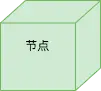

#

---

## 一、前言

谈到面向对象技术的分析和设计，自然就离不开 UML。

以下是本文大纲。

---

## 二、从一个示例开始

如果想通过在线的方式记录信息和行为，在软件世界中如何表达呢？

相信很多朋友的操作是，找到**主语和宾语**，也就找到了涉及的角色，然后通过**动词**来判断各个角色之间的**关系和能力**，最后用**代码的方式**来表达，产出可执行的程序。

像下图这样，识别出关键的实体和它们之间的关系。

现实世界错综复杂，灵活多变，每个人的理解可能会有不同，从现实世界到软件世界的映射，就变得困难重重，一团乱麻。

如何让现实世界到软件世界映射变的简单容易，这就是 UML 要解决的问题。

---

## 三、什么是 UML？

UML 全称是 ***Unified Modeling Language***（统一建模语言），它以图形的方式来描述软件的概念。

### 3.1 为什么称为语言

名称的落脚点是语言。既然是语言，那么它就会具备**语言的特性**，比如**结构上它由词汇和语法构成，功能上它能解决沟通问题**。

**人类语言本质上是事实和观点的表达，计算机语言本质上是0 和 1 的表达**。前者的表达形式是难以确定的，而且可能会产生歧义，所以才会有「被误解是表达者的宿命」这样的观点， 但后者就是确定性无歧义的 0 1 表达。

这么看来，UML 的目标是==通过一定结构的表达，来解决现实世界到软件世界的沟通问题==。

### 3.2 什么是建模

再说建模，模是什么，需要怎么建？

建模简单讲，是指通过抽象的方式解决某个领域的问题。各个抽象角度共同组成了一个问题领域。

对于传统模型而言，建造它是为了证明这个问题领域下某件事物能否工作。当然它有前提，即建造模型的成本远远低于建造实物的成本。比如造飞机或造高楼。

对于软件模型而言，建造它是为了与他人沟通，也为了保存这个问题领域下软件设计的最终成果。当然它也有前提，就是模型比代码更说明问题。

我们会发现，一个特定的事件（比如购物）里，会有特定的人的行为（比如甲乙丙要上电商网站），会有特定的物（比如货），有特定的规则（比如注册会员），共同完成购物这件事。

==特定的事 = 特定的人的行为 + 特定的物 + 特定的规则==

模简单讲，就是**人、事、物和规则**。

人是一切的中心，人要做事，做事就会使用一些物并产生另一些物，同时做事需要遵循一定的规则。

==人驱动系统，事体现过程，物记录结果，规则是控制==。

建立模型的关键就是**弄明白有什么人，什么人做什么事，什么事产生什么物，中间有什么规则，再把人、事、物之间的关系定义出来**，一个模型也就基本成型了。

### 3.3 统一的意义在哪

**统一的普遍意义是形成标准**。所谓标准，就是所有人都明白的表述，所有人都遵从的格式。标准可以让信息在人群中无障碍地流通，即使这些信息来自不同地域、不同文化、不同社会或不同组织。

在软件世界，任何一种组件化开发模式背后都有一个标准在规范和指导。**有了标准，编程就容易组件化，协作效率也会提升很多**。对 UML 来说，这就是统一的意义。

---

## 四、为什么需要 UML

一个软件项目要经历**业务调研、立项、需求采集、架构设计、编码开发和测试验证**等多个环节。

每个环节可能角色并不相同，同样的文档同样的话语越向后传递就越容易失真。因此就容易出现最终交付的产品不是客户真正想要的这种情况。

如何避免角色间信息传递的失真，保证信息能被准确的传达和准确的理解？一种好的办法就是**大家使用标准化的语言**。

统一建模语言(UML)就试图用标准化的语言来覆盖整个软件过程，让不同团队不同角色可以用相同的语言顺畅的沟通。

在信息传播方面，图形相对于文字，人脑的接受能力显然更强。因此，**UML 采用了「可视化」的图形方式来定义语言**。

---

## 五、UML 的适用场景

UML 既可以描述某个问题领域，也可以表达构思中的软件设计，还可以描述已经完成的软件实现。

它适用于面向对象分析设计的整个过程。这个过程可以分为三个阶段，如下图。

第一个阶段是==通过建模将现实世界转为业务模型==。业务模型真实映射了参与者（业务活动的驱动者）在现实世界的行为。

从图里可以看到，现实世界映射到业务模型后，是使用 **参与者** 和 **用例** 这两个 UML 的核心元素表达的。参与者作为一个特定事件的驱动者，用例则描述了这个驱动者的业务目标。

第二个阶段是==对业务模型概念化，建立适合计算机理解和实现的模型，也就是概念模型，或者叫分析模型==。分析模型向上映射了原始需求，向下为计算机实现规定了一种高层次的抽象，是一种过渡模型。

现实世界千差万别的业务，都用 边界、控制和实体这几个核心元素来描述，同时也引入了 包、组件 这些与现实世界毫不相干的概念做包装。

第三个阶段是==对概念模型实例化，得到相对详细的设计模型==。

在设计模型中，概念模型中的边界类可以被转化为操作界面或者系统接口；控制类可以被转化为计算程序或控制程序，例如工作流、算法体等；实体类可以转化为数据库表、XML 文档或者其他带有持久化特征的类。

**同样的概念模型会因为选择不同而得到不同的设计模型**。比如技术选型上使用不同的编程语言，不同的中间件就会得到不同的设计。

为什么需要这一道转换呢？

因为“边界”、“控制”、“实体”这些对象化的概念，虽然是计算机可以理解的，但它并不是真正的对象实例，也就是说它们并不是可执行代码，概念模型只是纸上谈兵。真正的对象世界行为是由 Java 类、C++ 类、JSP 等这些可执行代码构成的。

换句话说，**设计模型是概念模型在特定环境和条件下的实例化**，实例化后的对象行为执行了概念模型描述的那些信息。

以下是面向对象分析设计的完整过程，它表达了现实世界是怎么通过 UML 映射到对象世界的。

---

## 六、UML 的组成结构

前面花了比较大的篇幅分析了 UML 的定位和适用场景，目的是帮助读者建立对 UML 整体系统性的认知，而不是过早的陷入 UML 的使用细节里。我们要应用一项技术或工具，不能单纯的因为它的酷炫或者说业界都在用所以我们要用，而应该结合自己的使用场景以及技术或工具的特点，来确认这项技术或工具究竟是不是我们需要的。

在读者了解 UML 在面向对象分析设计领域优秀的特性之后，我们再来看看 UML 的一些细节。

凡是语言，都会存在基本词汇和语法。

那么对应到 UML 里，**基本词汇就是核心元素，语法就是核心视图**。

UML 的组成结构如下图：

### 6.1 核心元素

我们先介绍核心元素，下图是大纲。

#### 6.1.1 版型

版型：也称「类型」或「构造型」。**是对 UML 元素基础定义的扩展，在元素基础定义的基础上赋予特别的含义，使得这个元素适用于特定的场合**。

比如，我们前边提到的「边界类」、「实体类」、「控制类」都是类的版型。

#### 6.1.2 参与者

**参与者定位：事件的第一驱动者，也是系统的服务方**。比如你在电商网站购物，你就是参与者。

#### 6.1.3 用例

**用例定位：系统执行的一系列操作，并生成参与者可以观察的值**。比如你在电商网站交易，会生成在线订单，用户下单就是一个用例。

**用例版型**：

业务用例：**用于需求阶段业务领域建模**。与计算机系统建模无关，比如下单可以不依赖在线服务，而只是线下签署协议。业务建模的目标是让需求人员和客户能够达成共识。
业务用例实现：**业务用例的一种实现方式**。一个业务用例可以有多种实现方式。比如下单后的支付，可以用现金，也可以银行卡转账，还可以第三方支付。

概念用例：**用于获取业务模型中的关键概念，分析出核心业务结构**。业务架构就是概念建模阶段产生，同时为系统建模阶段提供重要指导。比如用户下单这个用例，可以从实现过程中获得一些核心业务，并把它们展现出来。

系统用例：**用于定义系统范围、获取功能性需求**。也就是我们常挂在嘴边的用例。像业务用例中提到的线下签约的方式，就不会纳入到系统用例中，但如果是电子签约的话，就可以成为系统用例了。
系统用例实现：**系统用例的一种实现方式**。一个系统用例可以有多种实现方式。比如下单后的支付，可以接入微信支付接口，也可以接入支付宝支付接口。
你会发现，同是用例的版型，业务用例与系统用例的区别就在于**业务用例是客户业务视角，系统用例是系统视角**。

#### 6.1.4 边界

**边界定位：用于业务建模和系统建模阶段的分析，保证分析粒度在一定的范围内，不会扩散**。

比如一个电商网站按领域职责作为边界，会有店铺域、商品域、会员域、交易域、支付域和营销域等。各域只负责域内的事情，就能够减少混乱紧耦合的局面。

#### 6.1.5 业务实体

**业务实体定位**：它代表参与者执行业务用例时所处理或使用的事物，特别用于在**业务建模阶段**建立领域模型。业务实体是类（class）的一种版型。

**业务实体的结构**：包含属性和方法。属性用来保存业务实体特征，方法用来访问业务实体。比如一台电视，把它看成一个业务实体的话，它的属性有运行状态和音量，它的方法就是遥控器，我们可以开、关、调声音，但是我们不可以试图让它飞起来——因为它没有这样的方法。

#### 6.1.6 包

**包定位：容纳并为其他 UML 元素分类**。比如 Java 后端经常会提供 jar 包给接入方使用。

#### 6.1.7 分析类

**分析类定位：用于代表系统中主要的职责簇，由此产生系统的设计类和子系统**。

**边界类：用于对系统外部环境和内部运作之间的交互进行建模**。比如现实世界的窗户，计算机世界的网页。
**控制类：用于对用例特有的控制行为进行建模**。比如显示逻辑和业务逻辑通过控制层分离的 MVC 架构。
**实体类：用于对需要存储的信息和相关行为进行建模**。源于业务模型中的业务实体。
分析类的抽象层次较高，比设计和实现要稳定很多，因此方便维护，也更容易获得一个稳定架构来指导整个软件的开发。

#### 6.1.8 设计类

**设计类定位**：是系统实施中一个或多个对象的抽象，由此**映射到实现代码**，依赖于实施语言。

**设计类结构**：

- **类型**：对对象某一方面特征的归纳和抽象。映射到编码中的 class。
-**属性**：对象特征。映射到编码中的 field。
- **方法**：访问对象属性的唯一途径。映射到编码中的 method。

#### 6.1.9 关系

**关系定位：抽象出对象之间的联系，让对象构成某个特定的结构**。

关系分为以下几种：

**关联（association）**
关系：**是一种拥有的关系，即一个类知道另一个类的属性和方法**。比如老师与学生可以是双向的，也可以是单向的。双向的关联可以有两个箭头或者没有箭头，单向的关联有一个箭头。
箭头和连线：带普通箭头的实心线，指向被拥有者。
适用场景：类图。
**依赖（dependency）**
关系：**是一种使用的关系，即一个类的实现需要另一个类的协助，是一种弱关系，随运行场景变化**。比如削苹果时，人依赖于刀，脱离了这个场景，依赖关系就不存在了。
箭头和连线：带箭头的虚线，指向被使用者。
适用场景：类图。
**泛化（generalization）**
关系：**是一种继承的关系**。比如猫是动物的一种。
箭头和连线：带三角的实线，箭头指向父类。
适用场景：类图。
**实现（realization）**
关系：**是一种实现的关系**。比如用例和用例实现的关系，接口与实现类的关系。
箭头和连线：带三角的虚线，箭头指向用例实现或接口类。
适用场景：用例图，类图。
**聚合（aggregation）**
关系：**是整体与部分的关系，且部分可以离开整体而单独存在。生命周期各自独立**。如车和轮胎是聚合关系，轮胎离开车仍然可以存在。
箭头和连线：带空心菱形的实线，菱形指向整体。
适用场景：类图。
**组合（composition）**
关系：**是整体与部分的关系，但部分不能离开整体而单独存在。同生同灭**。如公司和部门是组合关系，没有公司就不存在部门。
箭头和连线：带实心(黑色实心：要死一起死，良心是黑的)菱形的实线，菱形指向整体。
适用场景：类图。
关联关系和依赖关系的区别：

**关联关系是静态天然的联系，依赖关系是动态临时的联系。**
此外还有只用于用例中的关系：

**扩展（extends）**
关系：**用于在用例模型中说明向基本用例中的某个扩展点插入扩展用例**。
箭头和连线：带箭头的虚线加版型`<<extends>>`。
特点：用例可选。
**包含（include）**
关系：**用于在用例模型中说明在执行基本用例的用例实例过程中插入的行为段。**
箭头和连线：带箭头的虚线加版型`<<include>>`。
特点：用例必需。

#### 6.1.10 组件

**组件定位：实现特定功能的逻辑代码模块**。比如分布式应用架构下，将业务目标拆成多个功能，每个功能作为组件独立部署。这样这些组件也能被其他场景复用。

#### 6.1.11 节点

**节点定位：表示应用程序的部署单元**。比如分布式应用的环境中，服务器或设备会有很多，就需要通过节点来体现物理部署的情况。

### 6.2 核心视图

前面我们介绍了 UML 的核心元素，这些元素分别应用于面对对象分析设计的各个阶段，正是它们之间的相互组合，才形成了 UML 里的各种视图，最终指导软件设计。

接下来讲讲核心视图里的结构视图和行为视图，下图是大纲。

#### 6.2.1 结构视图

==结构视图也称为静态视图。静态视图就是表达静态事物的。它只描述事物的静态结构，而不描述其动态行为==。这里简要介绍的静态视图包括**用例图，对象图，类图，组件图，包图和部署图**。

##### 6.2.1.1 用例图

**用例图包含参与者、用例和关系这三种核心元素，不同的视角可以得到不同的用例视图，它展现了系统的功能性需求**。

所谓不同的视角，可以对应面向对象分析设计的三阶段。

建立业务模型阶段，产出**业务用例视图**。
建立概念模型阶段，产出**概念用例视图**。
建立设计模型阶段，产出**系统用例视图**。
就借阅图书的用例而言，业务用例视图如下，它是完全从业务角度出发，和计算机系统无关。

而我们在业务用例分析的过程中，可以分解出一些关键的概念用例，并建立它们之间的关系，如下图(bu 表示业务用例，cu 表示概念用例)。

我们对业务用例进行分析以后，就可以绘制系统用例视图。但不是所有的业务用例都有系统用例对应，比如检查借阅证可能是手工工作，就不需要纳入系统建设范围。

下图是借阅图书的系统用例视图。

##### 6.2.1.2 类图

**类图用于展示系统中的类及其相互之间的关系**。

类图建模常用的方式是从概念层，到说明层，最后到实现层这么一个抽象层次逐步降低和细化的过程。

**概念层类图**位于业务建模阶段，这个阶段采用业务实体这个核心元素来表示。

下图是网上购物的业务实体图。

网上购物主要由商品、订单、支付账户这几个关键类构成，这几个类的交互能够完成网上购物这个业务目标。

**说明层类图**位于概念建模阶段，这个阶段采用分析类这个核心元素来表示。

下图展示了网上购物的说明层类图，这个类图表达了从计算机的视角来说，网上购物这个业务目标是由哪些类来完成的，这些类的接口保证了这个业务目标的达成。

**实现层类图**位于设计建模阶段，这个阶段采用设计类这个核心元素来表示。

到了这一层，类图可视作伪代码，因此，在这个层次上，类必须明确采用哪种实现语言、什么设计模式、什么通信标准、遵循什么规范等。

下图展示了查询商品功能的类图。可以看到，到了实现层类图，类描述和类关系已经是伪代码级别了。

由此可见，在软件生命周期的不同阶段，类图也有三种不同的表达，他们分别是概念层类图，说明层类图和实现层类图。

很多朋友在建模的时候只会用到实现层类图，并非他们对问题领域足够了解，而是不清楚类图也分了这么三层。

##### 6.2.1.3 对象图

**对象图是类图的实例，标识和类图基本相同。由于对象存在生命周期，对象图只能在系统某一时间段存在，因此对象图可以被想象成正在运行的系统在某一时刻的快照**。

比如一个正在运行的列车，如果用对象图来描述，某个时间点你会发现以下静态图片：

当前的运行状态（运行中或停车中）
当前的乘客数量。（如果捕捉在不同的时间，该值会变化）

##### 6.2.1.4 包图

在实际的项目中，建模过程获得的元素可能是非常多的，如果将这些元素的关系都绘制出来，看上去就会特别乱，特别复杂，也难以识别。

那为了更好的理解和管理这些建模元素，我们就需要有规律的对元素进行组织。包图就起到了这么一个作用，**通过包这个容器，可以从大到小、从粗到细地将建模元素组织起来，便于我们的分析，交流和细化**。

下图是网上购物的领域包图，它表达了关键业务领域及其依赖关系。

下图展示了查询商品功能的类层次，它表达了实现类位于哪个层次的软件架构的观点。

##### 6.2.1.5 组件图

当有些包能够被多个场景重复使用，那这个包就可以认为有着特定的功能，能够完成特定的目标。

这种情况下，包就可以定义为组件，**组件是一种特殊的包，既起到了普通包组织和容纳的作用，又能完成特定的功能**。

比如模块（登录模块），类库（Java Guava 包）。

下图可以表达组件实现的过程，通过第三方软件或者面向对象分析设计过程中产生的各种包，可以定义组件。

组件可以按功能分为以下几类：**模块、子系统、库、可执行文件和程序包**等等。

##### 6.2.1.6 部署图

**部署图描述了物理上系统运行时的结构，包括系统中硬件的分布以及软件部署到硬件上的具体方式**。

部署图用于设计建模阶段，**采用节点和关系两种核心元素来绘制**。常用于分布式应用环境和多设备应用环境。

上图是一个简单的部署图，表达了客户端比如浏览器这个节点，会请求到 Web 服务器节点，最后通过数据库服务器节点返回数据。如果涉及分布式环境，就要考虑多个 Web Server，多个 Database Server，甚至考虑多机房，异地等物理层面的部署方式。

---

#### 6.2.2 行为视图

行为视图也称为动态视图。**动态视图就是描述事物动态行为的**。动态视图不能独立存在，它必须基于一个静态视图或者 UML 元素，说明在静态视图规定的事物结构下它们的动态行为。

这里简要介绍的动态视图包括**状态图、活动图、时序图和协作图**。

##### 6.2.2.1 状态图

**状态图也称状态机，它描述了一个对象的生命周期**，你可以把它理解成一台运行中的机器，这台机器负责这个对象在固定几个状态间的流转。

这个对象可以是业务实体对象，也可以是分析类对象，还可以是设计类对象。也就是说，**在面向对象分析设计的三个阶段（业务建模，概念建模，设计建模），都可以用状态图来表达**。

下图是一个产品的生命周期状态图。绿色部分是状态图相关的元素，红色部分是元素的解释。

从图中，我们可以看到，状态图有以下关键元素：

**初始状态：它是状态机的起始位置，不需要事件的触发**。用实心圆圈表示。
**状态：状态是对象执行某项活动或者等待某个事件时的条件**。比如要想执行产品入库动作，产品得是未入库的状态，如果想销售某个产品，产品得是入库的状态。
**转移：转移是两个状态之间的关系，它表示当发生指定事件并且满足指定条件时，第一个状态中的对象将执行某些操作并进入第二个状态**。比如产品入库这个动作，就将产品的状态从未入库转移到了已入库。
**事件：事件是一个特定的动作或行为，有时候也包括系统时钟之类的定时器。如果条件满足，事件的发生将触发一个转移**。比如产品销售这个动作，出发产品从已入库状态转移至已销售状态。
**条件：条件是一个布尔表达式，当事件发生时将检查这个表达式的值**。条件求值结果可能决定转移的分支，或者拒绝转移。条件有可能引用当前状态。比如产品合不合格这个布尔判断，决定了产品是可被销售，还是不可被销售。
**最终状态：最终状态表示状态机执行结束，或者对象生命周期结束**。用带环的实心圆圈表示。

##### 6.2.2.2 活动图

**活动图描述了为了完成某一个目标需要做的活动以及这些活动的执行顺序**。

UML 中有两个层面的活动图，一种是**用例活动图**，它用于描述用例场景，常用于业务建模阶段，另一种是**对象活动图**，用于描述对象交互，常用于设计建模阶段。

下图是一个登机手续办理的用例活动图。绿色部分是活动图相关的元素，红色部分是元素的解释。

从图中，我们可以看到，活动图有以下几个关键元素：

**起始点：起始点标记业务流程的开始**。一个活动图仅有一个。用实心圆圈表示。
**活动：活动是业务流程中的一个执行单元**。比如办理登机手续需要出示机票和身份证这样的动作。
**判断：判断根据某个条件进行决策，执行不同的流程分支**。比如身份核对决定了你能否继续办理登机手续。
**基本流：表示最主要、最频繁使用的、默认的业务流程分支**。比如身份核对的正常分支。
**支流：支流是进行判断后走进的业务流程分支**。比如图中无行李分支。
**异常流：异常流表示非正常的、不是业务目标期待的、容错性的、处理意外情况的业务流程分支**。比如身份证核对错误。
**同步：同步分为同步起始和同步汇合**。
同步起始表示从它开始多个支流并行执行。比如托运行李的处理和登机牌的打印操作，可以并行。
同步汇合表示多个支流同时到达后再执行后续活动。
**结束点：结束点表示业务流程的终止**。一个或多个。
用例活动图常常是从业务的角度上，分析要完成某个目标，要执行哪些活动。如果在系统设计的角度上，要表达完成目标需要的活动，就需要用到对象活动图。

比如根据查询商品的对象交互过程，就能绘制出以下的对象活动图。

虽然 UML 允许用活动图绘制对象交互，但实际工作中，我从来没用过。因为 UML 有其他更好的工具来绘制对象交互图，比如接下来要讲的时序图。

##### 6.2.2.3 时序图

**时序图用于描述按时间顺序排列的对象之间的交互模式**。

前面类图那一节有提过类有三个层次的观点：**概念层、说明层和实现层**，分别对应于面向对象分析设计的**业务建模阶段、概念建模阶段和设计建模阶段**，相应的，也可以在这三个层次上分别对**业务实体对象、分析类对象和设计类对象**绘制业务模型时序图、概念模型时序图和设计模型时序图。

接下来介绍三种时序图。

**业务模型时序图用于为领域模型中的业务实体交互建模，目标是实现业务用例**。

上一节提到的活动图，可以帮助我们发现业务实体，活动图也可以很轻易的转换成时序图，下图是网上购买商品的业务模型时序图。

时序图中会涉及一些 UML 元素，这里列举常用的几个：

**对象：表示参与交互的对象**。每个对象都有一条生命周期线，对象被激活时，生命周期线上会出现一个长条（会话），表示对象的存在。
生命周期线：表示对象的存在。当对象被激活时，生命周期线上出现会话，表示对象参与了这个会话。
**消息：表示对象间交互所发生的动作**。由一个对象的生命周期线指向另一个对象的生命周期线。常见的消息类型有以下几种：
**简单消息：向右的实线箭头**。这种最为常用。
**返回消息：源消息的返回体，并非新消息**。用向左的单向虚线箭头表示。一般不需要为每个源消息都绘制返回消息，一方面源消息默认情况下都有返回消息，另一方面过多的返回消息会让图变得更复杂。
**同步消息：表示发出消息的对象将停止所有后续动作，一直等到接收消息方响应**。用向右带×的单向实线箭头表示。同步消息将阻塞源消息所有行为。通常程序之间的方法调用都是同步消息。
**异步消息**：表示源消息发出消息后不等待响应，而可以继续执行其他操作。用向右的单向上箭头表示。异步消息一般需要消息中间件的支持，如 MQ 等。
**会话：表示一次交互，在会话过程中所有对象共享一个上下文环境**。例如操作上下文。
**销毁：表示生命周期的终止**。绘制在生命周期线的末端，一般没有必要强调。
业务模型时序图是业务建模阶段的产物，它展现了业务的实际需求，因此使用的描述语言应当采用业务术语。

进入概念建模阶段，可以采用分析类绘制概念模型时序图。和业务模型时序图相比，同样是展现业务需求，不同点在于分析类代表了系统原型，所以这个阶段的时序图已经带有了计算机层面的理解。

因此，概念模型时序图既保留了实际业务需求，又得到了计算机实现的基本理念。如下图所示。

可以看到，在概念模型时序图里，相对于业务模型时序图，我们的表达增加了安全认证和商品目录。这是因为我们实际在做登录这个功能时，我们的软件系统需要关心身份核验。我们在获取商品时，为了避免杂乱需要对其进行分类。

另外，我们的业务实体转为分析类进行表达，网站作为边界类，用于隔离用户操作和系统行为。安全认证作为控制类，用于决定是否能成功登录网站。商品目录和商品作为实体类，用于表达用户实际想看到或者操作的实体信息。

分析类展示出来的已经是系统实现的原型，进入设计建模阶段，我们做的工作就是要选择合适的实现方式来实现这个原型。

设计建模阶段，我们采用设计模型时序图来实现概念模型中的交互。

设计模型时序图使用设计类作为对象绘制，也是我们日常开发设计中最为常用的动态视图。以下是商品查询的设计模型时序图。

可以看到，在设计模型时序图里，消息会细致到方法级别。因为在这个阶段，相关的技术选型，比如编程语言，交互协议，中间件等已经比较明确了。

时序图除了在建模的三个阶段使用外，当你需要表达对象的交互，或者想分析对象的职责和接口时，都可以使用时序图。

##### 6.2.2.4 协作图

协作图和时序图一样，也是描述对象之间的交互模式，不同的是，**时序图在意的是对象交互的执行顺序，而协作图在意的是对象间的结构关系**。

因此，时序图适用于获得对调用过程的理解，而协作图适用于获得对对象结构的理解。

协作图可以和时序图互相转换，对应时序图的三种表达方式，协作图也分为业务模型协作图，概念模型协作图和设计模型时序图。本文只介绍业务模型协作图，另外两种协作图可以由相应的时序图推导，这里就不赘述了。

业务模型协作图同样采用业务实体来绘制，目标也是实现用例场景。下图是网上购买商品的业务模型协作图。

可以看到，协作图和时序图相比，对象间的结构一目了然，很容易知道哪些消息会影响哪些对象或者哪些对象需要提供哪些接口。但在执行顺序的表达上就很弱，必须依赖消息文本里的数字。

以下是协作图常用的 UML 元素：

**对象**：表示参与协作的对象。
**对象关联**：用于连接两个对象，表示二者的关联。这种关联是临时的，只在本次交互中有效。
**消息**：和时序图中的消息定义一致。
**消息序号**：表明消息传递的先后顺序。

#### 6.2.3 小结

本节介绍了 UML 的核心视图，我们再看下核心视图的大纲。

核心视图分静态视图和动态视图。静态视图**表达事物的结构性观点**，动态视图**表达事物的行为性观点**。

一个好的建模，结构性和行为性都不可或缺，既要说明**该事物长什么样子**，又要说明**该事物应该怎么用**。

---

## 七、总结

本文从一个示例开始，引入了 UML 的概念，介绍了什么是 UML，为什么要用 UML以及什么时候用 UML。我们了解一个事物，知其然也要知其所以然。

然后介绍了 UML 的组成结构，从元素和视图的角度出发，讲解了绘制图形的方法和相关概念。文中也给出了很多我亲手绘制的样例视图，如有错误之处，还望读者指摘。

1. UML:用于面向对象技术的分析与设计。
2. 从现实世界到软件世界的映射：找到主语和宾语（角色）、动词（关系和能力），最后用代码方式表示。
3. UML:通过结构化的表达，统一建模问题。
4. 特定的事 = 特定的人的行为 + 特定的物 + 特定的规则。人驱动系统，事体现过程，物记录结果，规则是控制。
5. 项目开发环节：业务调研、立项、需求采集、架构设计、编码开发和测试验证。UML：标准化、可视化。
6. UML适用场景：面向对象设计全过程：现实世界->业务模型->概念模型->设计模型。业务模型：提取出实际需求。概念模型：从计算机领域来考虑需求。设计模型：具体的实现。
7. 核心元素：版型：关键字。参与者：客户。用例：操作。边界：分析粒度。业务实体：操作的对象。包：UML的分类。组件：完成特点功能的逻辑代码模块。节点：应用程序的部署单元。关系：关联、依赖、泛化、聚合、组合、实现。分析类：功能模块。设计类：代码中的类。
8. 核心视图：类图、时序图等。

**纸上得来终觉浅，绝知此事要躬行**。

---
